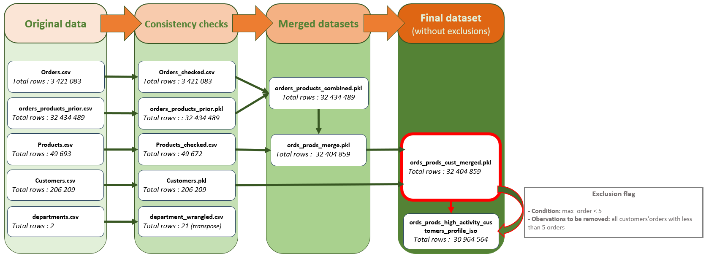

# PYTHON-showcase_Instacart-data-analysis :carrot:

## 1. Context

Instacart already has very good sales, and they want to uncover more information about their sales patterns. Stakeholders are most interested in the variety of customers in their database along with their purchasing behaviors. They assume they can't target everyone using the same methods, and they’re considering a targeted marketing strategy. They want to target different customers with applicable marketing campaigns to see whether they have an effect on the sale of their products.

 The analysis will inform what this strategy might look like to ensure Instacart targets the right customer profiles with the appropriate products.

## 2. Key questions leading the project

- What the busiest days of the week and hours of the day are (i.e., the days and times with the most orders) in order to schedule ads at times when there are fewer orders?
- Are there particular times of the day when people spend the most money, as this might inform the type of products they advertise at these times?
- Could Marketing and sales use simpler price range groupings to help direct their efforts?
- Are there certain types of products that are more popular than others?
- Who are the different types of customers in their system and how their ordering behaviors differ?
  - What’s the distribution among users in regards to their brand loyalty (i.e., how often do they return to Instacart)?
  - Are there differences in ordering habits based on a customer’s loyalty status?
  - Are there differences in ordering habits based on a customer’s region?
  - Is there a connection between age and family status in terms of ordering habits?
  - What different classifications does the demographic information suggest? Age? Income? Certain types of goods? Family status?
  - What differences can you find in ordering habits of different customer profiles?

## 3. Data set & tools

- Most files were collected on “The Instacart Online Grocery Shopping Dataset 2017”, Accessed from www.instacart.com/datasets/grocery-shopping-2017 via [Kaggle](https://www.kaggle.com/datasets/yasserh/instacart-online-grocery-basket-analysis-dataset), dowloaded on May 20th 2024.

> [!CAUTION]
> Data about customers has been fabricated by [Careerfoundry](https://careerfoundry.com/) for the purpose of the tuition and is not representative of real instacart customers

**Data population flow**

- **Python Libraries at work on this project:**
  - Pandas
  - Numpy
  - OS
  - Matplotlib.pyplot
  - Seaborn
  - Plotly

*Only Jupyter Notebooks, running Python 3, on an Anaconda environment have been used.*

## 4. Links to PYTHON scrypts

- [Script showcasing a working file countaining the following:](Scripts/full_data_analysis_showcase.ipynb)
   - Importing libraries and datasets
   - Initial Data Inspection
   - Data Cleaning/wrangling
   - Univariate Analysis
   - Bivariate Analysis
   - Deriving variables
   - Pivot tables and Data visualizations
     - [Violin distribution by profile](Viz/Violin_distribution_profiles.png)
     - [Repartition of customers by their spending flag](Viz/Spending_flag_repartition.png)
     - [Barplot of the average price by customer profile and by US region](Viz/Barplot_average_price_by_region_and_customer_profile.png)
     - [Heatmap of money spent by customer profiles accross US states](Viz/Heatmap_profile_avg_price.png)
     - [Choropleth map of money spent accross US by customer profile](Viz/Map_client_profile_avg_price.html) *.html not supported, interactive file to be downloaded*
   - Exporting Dataframes and visualizations

## 5. [Final Report](Final_Report/A4_final_report_Matthieu.xlsx) *Excel workbook to be dowloaded since the format is not supported inside Github*
